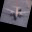

# CIFAR-10 Video Generation and Playback

## Dataset Information

The [CIFAR-10 and CIFAR-100](https://www.cs.toronto.edu/~kriz/cifar.html) are labeled subsets of the 80 million tiny images dataset. They were collected by Alex Krizhevsky, Vinod Nair, and Geoffrey Hinton.

The dataset is divided into five training batches and one test batch, each with 10,000 images. The test batch contains exactly 1,000 randomly selected images from each class. The training batches contain the remaining images in random order, but some training batches may contain more images from one class than another. Between them, the training batches contain exactly 5,000 images from each class.

**Note:** The classes are completely mutually exclusive. There is no overlap between automobiles and trucks. "Automobile" includes sedans, SUVs, things of that sort. "Truck" includes only big trucks. Neither includes pickup trucks.

## Project Overview

This project generates synthetic videos from CIFAR-10 images and allows you to play them back sequentially. Each video represents a sequence of frames for a specific class within the CIFAR-10 dataset, with random transformations applied to each frame to create visual variety.

## Project Structure

```
main_project_folder/
├── cifar10.py          # Script for generating videos from CIFAR-10 images
├── play_videos.py      # Script for playing back the generated videos
├── cifar-10-batches-py/# Folder containing CIFAR-10 data batch files
├── cifar10_videos/     # Output folder for generated videos
```

## Video Demonstration

This project processes images from the CIFAR-10 dataset to create video sequences of similar objects. Below is an example of generated video sequences for the airplane class, showing how the algorithm transitions between different airplane images in the dataset.

### Example: Airplane Class Transitions



The video demonstrates:

- Smooth transitions between different airplane images from the dataset
- Random transformations (rotation, scaling, and shifting) being applied to each frame
- The variety of airplane images in the CIFAR-10 dataset and how they're processed

## Steps to Run the Project

### 1. Install Required Libraries

Make sure you have the following Python libraries installed:

```bash
pip install numpy opencv-python-headless matplotlib
```

### 2. Generate Videos

1. Run the `cifar10.py` script to generate synthetic videos from CIFAR-10 images:
   ```bash
   python3 cifar10.py
   ```
2. This script loads images from CIFAR-10 batch files, applies random transformations (rotation, scaling, and shifting), and saves each transformed image sequence as a video in the `cifar10_videos` folder.

### 3. Play the Generated Videos

1. Run the `play_videos.py` script to view the videos sequentially:
   ```bash
   python3 play_videos.py
   ```
2. The playback script will open each video one by one in a window. To close the current video and proceed to the next, press `q` (or another specified key) while the video window is active.

## Key Code Features

### Video Generation (`cifar10.py`)

- **Image Transformations**: Each frame undergoes random transformations:
  - **Rotation**: Random angle between -30 and 30 degrees
  - **Scaling**: Random zoom between 0.8 and 1.2
  - **Shifting**: Random x and y shifts between -5 and 5 pixels
- **Video Creation**: Transformed images are saved as `.avi` files, organized by class and batch

### Video Playback (`play_videos.py`)

- **Sequential Playback**: Each video is loaded and played one by one
- **Key Control**: Press `q` to close the current video and move to the next. Press `Ctrl+C` in the terminal to stop playback entirely

## Project Requirements

- Python 3.x
- Libraries:
  - `numpy`
  - `opencv-python-headless`
  - `matplotlib`

## Example Output

You will find generated videos in the `cifar10_videos` folder. Each video represents frames for a specific class from a specific data batch.

## Citation

This tech report (Chapter 3) describes the dataset and the methodology followed when collecting it in much greater detail. Please cite it if you intend to use this dataset:

**Learning Multiple Layers of Features from Tiny Images**, Alex Krizhevsky, 2009.
